# Human Activity Recognition using Gaussian Latent Dirichlet Allocation 

Human Activity Recognition(HAR) from the multivariate sequential sensor data is one of the challenging research problems in pattern recognition and data mining. Most of the machine learning algorithms and deep learning techniques have shown great performance in solving HAR as a classification problem. But, the availability of annotated data is very difficult in many cases. It is very critical to precisely recognize the underlying patterns in sequential data in an unsupervised manner. In our experiment, we explored the performance of Gaussian Latent Dirichlet Allocation(GLDA) in recognizing human activities by considering the latent temporal patterns generated by sensory words. In-text modelling, GLDA has achieved great results by generating semantic coherence between topics with the help of distributed word embeddings. The model architecture, feature extraction techniques and analysis of GLDA results are briefly discussed below with the images.\
 

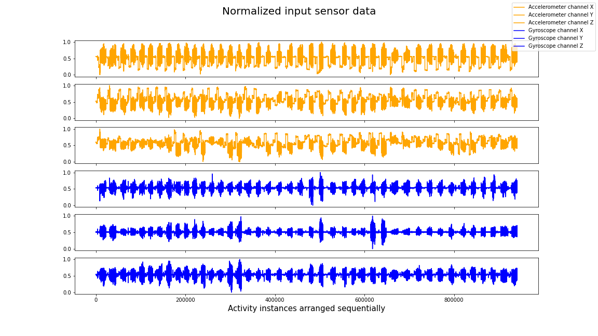

 <H3>Fig:  1 Input Data Sequence.</H3> 

 

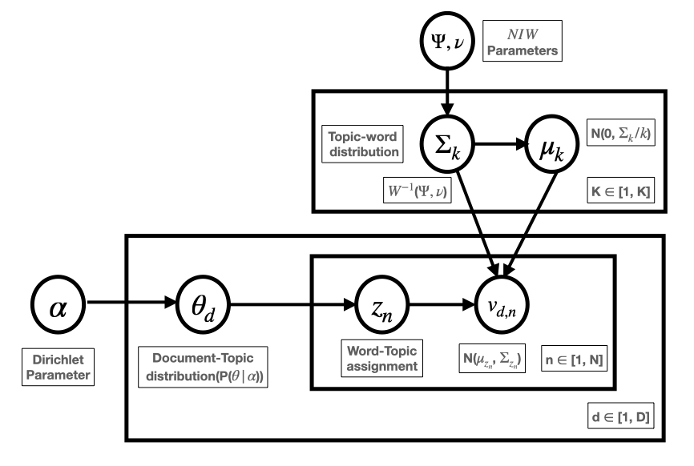

 <H3>Fig:  2 Graphical Notation Representing GLDA Model.</H3> 

 

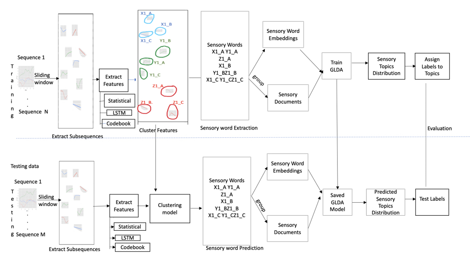

 <H3>Fig:  3 Flow Chart Explaining the Process of Training, Testing and Evaluation of GLDA.</H3> 

 

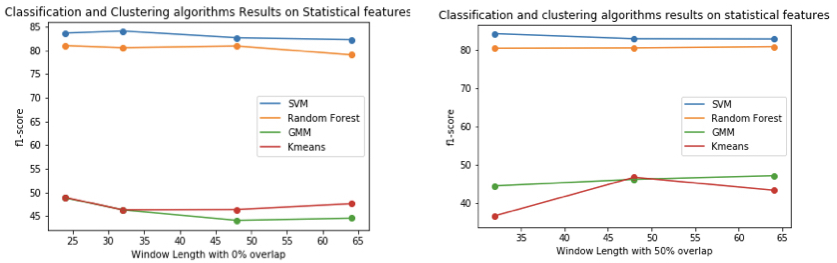

 <H3>Fig:  4 Classification and Clustering Algorithms Performance on Statistical Features with Different Window Lengths and 0\%, 50\% Overlap.</H3> 

 

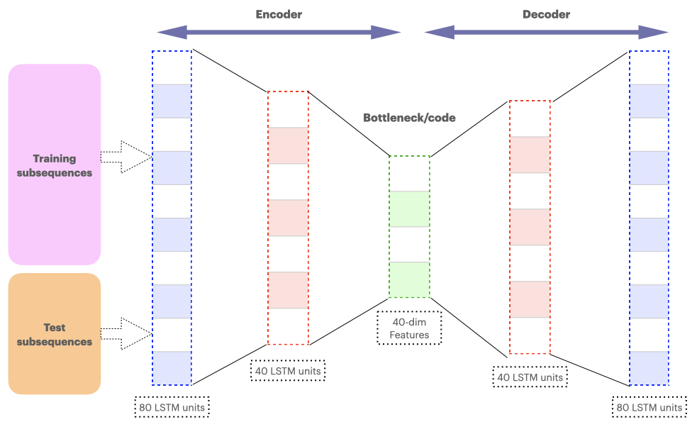

 <H3>Fig:  5 Stacked LSTM Autoencoder Feature Extraction.</H3> 

 

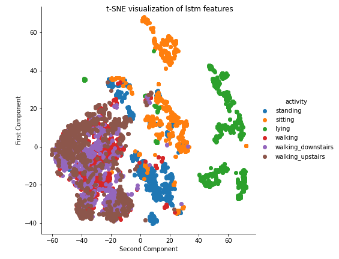

 <H3>Fig:  6 t-SNE Visualization of Autoencoder Features.</H3> 

 

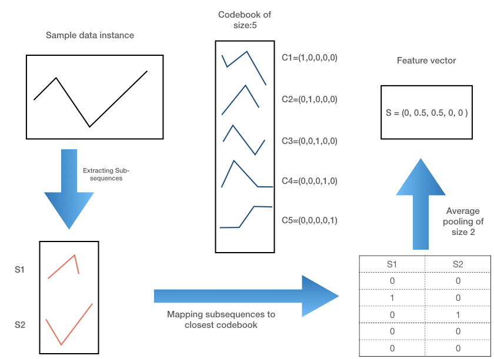

 <H3>Fig:  7 Codebook Feature Extraction Process Flowchart.</H3> 

 

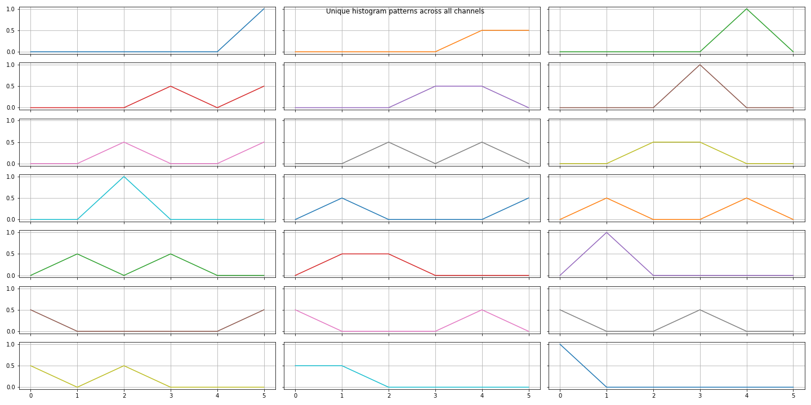

 <H3>Fig:  8 Unique Histogram Features.</H3> 

 

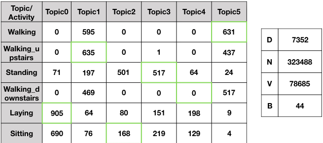

 <H3>Fig:  9 GLDA Activity Topic Mapping on Statistical Features.</H3> 

 

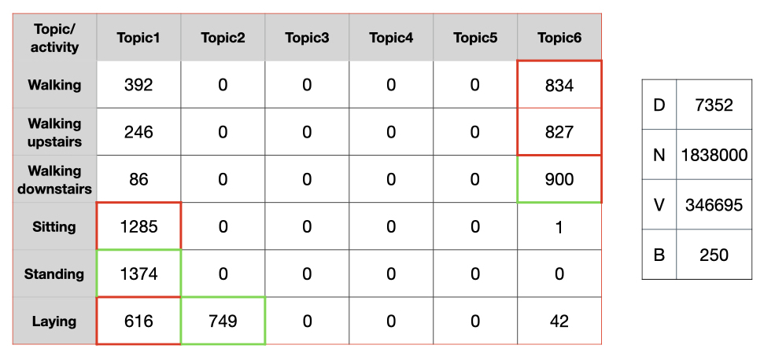

 <H3>Fig:  10 GLDA Activity Topic Mapping in Case of lstm Autoencoder Features.</H3> 

 

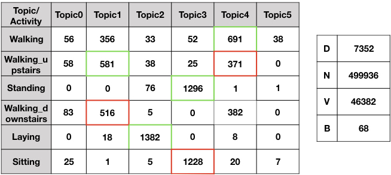

 <H3>Fig:  11 GLDA Activity Topic Mapping on Codebook Features.</H3> 

 

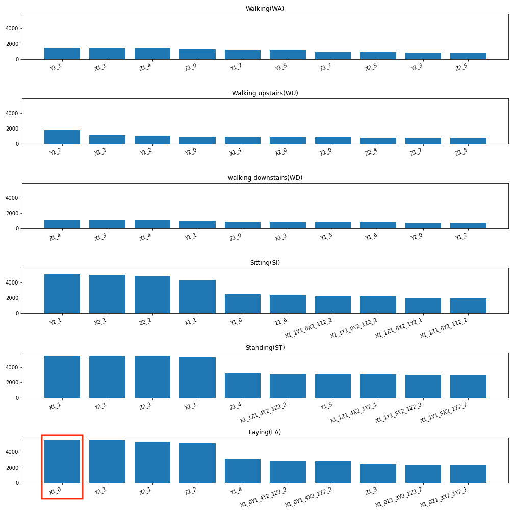

 <H3>Fig:  12 Top 10 Activity Words with their Frequencies.</H3> 

 

| Features    | SVM   | Random Forest | K-means | GMM   | GLDA  |
|-------------|-------|---------------|---------|-------|-------|
| Statistical | 82.85 | 81.12         | 45.37   | 51.51 | 40.59 |
| Autoencoder | 80.48 | 79.96         | 48.94   | 53.48 | 17.87 |
| Codebook    | 69.22 | 69.44         | 43.57   | 43.57 | 55.88 |

 <H3>Table: 1 F1-score Evaluation of Raw Features.</H3> 

